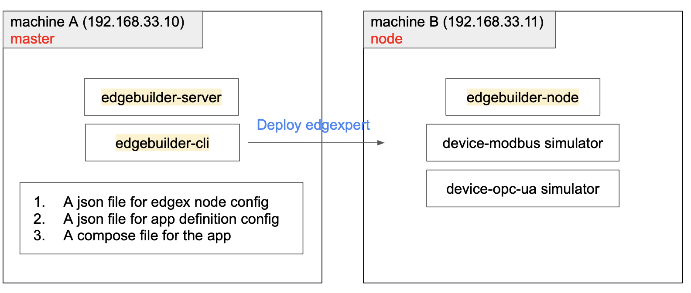
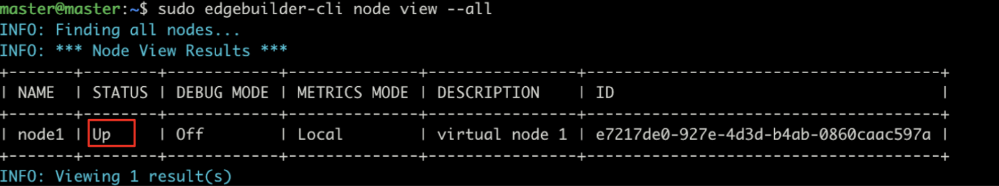
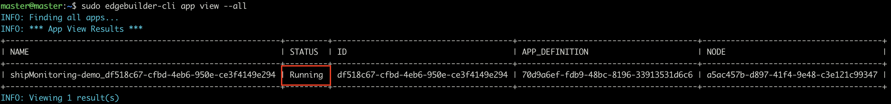

# Edge Xpert Ship Monitoring Demo with Edge Builder
## Overview
This demo provides a pair of appDefinition file **app-def-config.json** and corresponding docker-compose file **docker-compose.yml** to deploy EdgeXpert services by Edge Builder and automatically set up Ship Engine Monitoring configs.

The docker-compose file contains various Edge Xpert services, including **device-modbus** and **device-opc-ua** that will collect and ingest data from the simulators that represent ship engine equipment and will periodically send events to EdgeX Core-Data service for persistence, and export-client 
service will subscribe for these events and then publishes these events to InfluxDB. Additionally, the EdgeX application service will export the events to AWS IoT Core.

To set up the device-modbus(temperature & power) and device-opc-ua(pressure) services with simulated devices, this tutorial will build a special container to add device profiles and devices into EdgeX 
Core-Metadata service for provisioning. The container will also add InfluxDB registration to export-client, and InfluxDB datasource and a default dashboard to Grafana. This special container--**service-setup**--is part of docker-compose file, and it will be 
automatically started up when being deployed by Edge Builder.    




### The service-setup container
This main purpose of this container is to set up the Ship Engine Monitoring configs, including:
* add device profiles into Core-Metadata
* add devices into Core-Metadata
* add export registrations into Export-Client
* add datasource and dashboard into Grafana 

Examine the **setup** folder of this sample, there are various files and folders:
* **Dockerfile** - the Dockerfile used to build service-setup docker image
* **setup.sh** - the entrypoint script inside the service-setup container to set up the Ship Engine Monitoring configs
* **build.sh** - the shell script to build the docker image for service-setup container
* **devices** - folder containing payload files for adding devices: *Engine Modbus*, and *Engine OPC UA*
* **profiles** - folder containing payload files for adding device profiles: *Engine Modbus*, and *Engine OPC UA*
* **registrations** - folder containing payload files for adding export registrations
* **dashboards** - folder containing payload files for adding Grafana dashboards

#### The entrypoint script - setup.sh
In this example, **setup.sh** will issue several REST calls to set up the demo:
* issue **Core-Metadata GET /api/v1/ping** to check if it is ready
* issue **Core-Metadata POST /api/v1/deviceprofile/uploadfile** to add the device profiles
* issue **Core-Metadata POST /api/v1/device** to add the devices
* issue **Export-Client GET /api/v1/ping** to check if it is ready
* issue **Export-Client POST api/v1/registration** to add the export registrations
* issue **Grafana POST /api/datasources** to add InfluxDB datasource
* issue **Grafana POST /api/dashboards/db** to add dashboards

#### The docker image of service-setup
Pull the image **iotechsys/edgexpert-demo-lua:shipMonitoring-demo-x86_64** from DockerHub or use the command below to build the image.
```shell
# ./build.sh <push_or_not> <image tag name> 
cd path-to-setup
./build.sh true shipMonitoring-demo
```

## Prerequisite
1. Edge Builder environment up and running:   
    * Edge Builder Server on the master (machine A)
    * Edge Builder CLI on the master (machine A)
    * Edge Builder Node on the node (machine B) 

*note: When install SaltStack for edgebuilder-node on Ubuntu Desktop, may need to specify arch (e.g. [arch=amd64] ) in /etc/apt/sources.list.d/saltstack.list*
 
2. Copy the **node-config.json**, **app-def-config.json** and **docker-compose.yml** in this sample into the master (machine A)
3. Follow the instructions in [Ship Engine Monitoring Demo.pdf](ShipMonitoringDemo_AWS/Ship%20Engine%20Monitoring%20Demo.pdf) to run the device-modubs and device opc-ua simulators on the node (machine B)
    * Refer to Demo Preparation Step 3 for the OPC-UA Simulation Server 
    * Refer to Running the Demo Step 2 and Step 3 for the ModbusPal simulator (Download:[ModbusPal.jar](https://drive.google.com/file/d/1_oNAZoFem26xL2IQh9ADbcq53hGYitKP/view?usp=sharing))

## Run the Demo
Must have already logged in Edge Builder and added the license.
### 1. Add node
The **node-config.json** file defines the node name, node ip address(192.168.33.11), node username/password for SSH, and the master ip(192.168.33.10). In this demo, this file only defines one node, but it can contains multiple nodes in one node configuration file.
```json
{
  "NodeConfig": [
    {
      "name": "node1",
      "description": "virtual node 1",
      "nodeaddress": "192.168.33.11",
      "username" : "node",
      "password" : "0000",
      "serveraddress": "192.168.33.10",
      "groups" : []
    }
  ]
}
```
Run the command to add node:
```shell
sudo edgebuilder-cli node add -f <path-to-node-config.json>
```
Check the status of the node if it is "Up":
```shell
sudo edgebuilder-cli node view --all
```

### 2. Add appDefinition
The **app-def-config.json** file defines the app name and the path of the corresponding compose file. 
```json
{
  "AppDefinitionConfig": [
    {
      "Name": "shipMonitoring-demo",
      "Description": "A simple ship monitoring demo",
      "ComposeFile": "/home/master/shipMonitoring-demo/docker-compose.yml"
    }
  ]
}
```
Run the command to add appDefinition:
```shell
sudo edgebuilder-cli appDefinition add -f <path-to-app-def-config.json>
```
### 3. Add app config and config files
The **app-config-files.json** and **app-config.json** files define the paths to app config files and the mapping of those files to paths/volumes on the node. Before running the following commands, update the **app-config.json** file to include the ID of the app definition just created.

Run the command to add app config files:
```shell
sudo edgebuilder-cli appConfigFile add -f <path-to-app-config-files.json>
```
Run the command to create the app config:
```shell
sudo edgebuilder-cli appConfig add -f <path-to-app-config.json>
```

### 3. Create and start an app instance on the node
Run the command to create app:
```shell
# edgebuilder-cli app create -d <appDefinition name> -n <node name>
sudo edgebuilder-cli app create -d shipMonitoring-demo -n node1 -c ShipMonitoringDemo
```
Run the command to start app:
```shell
sudo edgebuilder-cli app start -a <app name or app id>
```
Check the status of the app, it will take some time to become "Running":
```shell
sudo edgebuilder-cli app view --all
```


### 4. Open Browser to AWS IoT and Grafana to see data updates
Wait for the service-setup container to finish the setup (~ 1 min).
* [AWS IoT](https://us-east-2.console.aws.amazon.com/iot/home?region=us-east-2#/thinghub) -> Manage -> Things -> Engine -> Shadow
* Grafana: http://192.168.33.11:3000/d/VvC5eGcMk/ship-monitoring-dashboard?refresh=5s&orgId=1

### 5. Remove app, appDefinition and node
Run the command to remove app:
```shell
sudo edgebuilder-cli app rm -a <app name or app id>
```
Run the command to remove appDefinition:
```shell
# edgebuilder-cli appDefinition rm -d <appDefinition name or appDefinition id>
sudo edgebuilder-cli appDefinition rm -d shipMonitoring-demo
```
Run the command to remove node:
```shell
# edgebuilder-cli node rm -n <node name>
sudo edgebuilder-cli node rm -n node1
```
