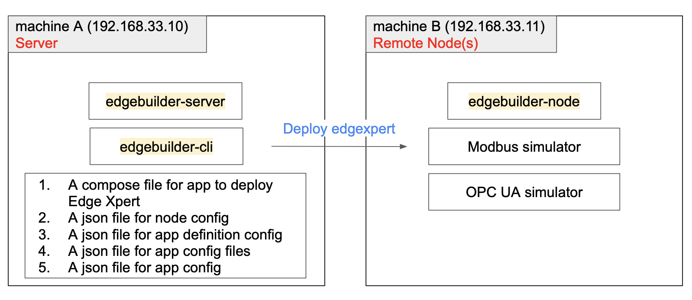
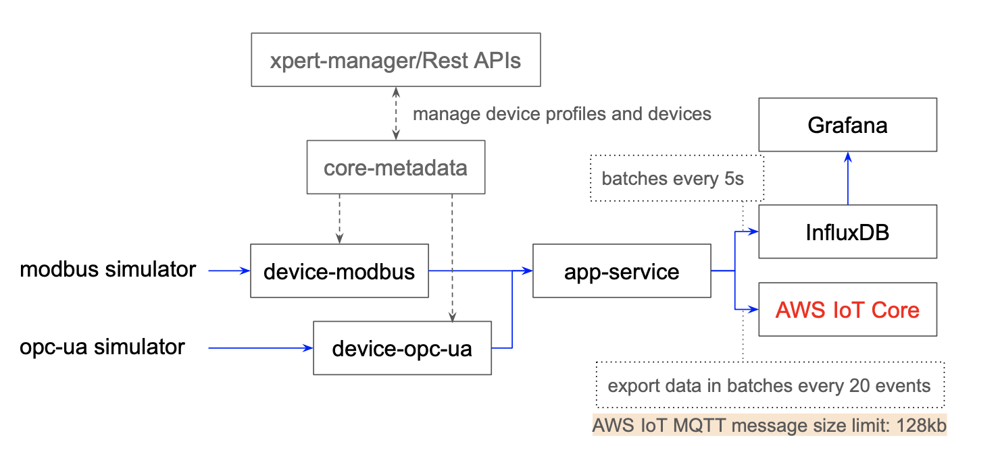

# Edge Xpert Large Signals Demo with Edge Builder
## Overview



This demo provides a node config **node-config.json**, an app definition **app-def.json**, an app config **app-config.json**, an app file config **app-config-file.json**, and a corresponding docker compose file **docker-compose.yml** to deploy Edge Xpert services on the remote node(s) by Edge Builder and automatically set up the Edge Xpert configs.

The docker-compose file contains various Edge Xpert services, including **device-modbus** and **device-opc-ua** that collect and ingest the simulated data, and the events are sent through internally Redis message bus to EdgeX app services directly, and then the app services publishe these events to InfluxDB and AWS IoT Core.

Edge Xpert services on the remote node(s):



To set up the device-modbus and device-opc-ua services with simulated devices, this tutorial will build a special container to add device profiles and devices into EdgeX 
Core-Metadata service for provisioning. The container will also add InfluxDB datasource and a default dashboard to Grafana. This special container--**service-setup**--is part of docker-compose file, and it will be 
automatically started up when being deployed by Edge Builder.    

## Preparation
* Install Edge Builder 1.1.3 and start running:   

  To obtain the Edge Builder license, please contact [IOTech Support](https://www.iotechsys.com/contact/contact-us/).
  
  * Edge Builder Server on the server (machine A)
  * Edge Builder CLI on the server (machine A)
  * Edge Builder Node on the node (machine B)
  
  Run the following commands to start Edge Builder and add license on the server
  ```shell
  # Run on server (machine A)
  # Start Edge Builder Server: 
  edgebuilder-server up -a <server-ip-address>
  e.g. edgebuilder-server up -a 192.168.33.10
  
  # Log in to Edge Builder with a default admin user account: username/password = iotech/EdgeBuilder123
  edgebuilder-cli user login -u iotech -p EdgeBuilder123 -c "http://<server-ip-address>:8085"
  e.g. edgebuilder-cli user login -u iotech -p EdgeBuilder123 -c "http://192.168.33.10:8085"
  
  # Add valid license: 
  edgebuilder-cli license add -l <license-name> --file <path-to-edge-builder-license>
  e.g. edgebuilder-cli license add -l DemoLicense --file EdgeBuilder_IoTech_Evaluation.lic
  ```

* Start ModbusPal on the node 
  * Load the simulator config **Modbus.xmpp**
  
* Start Prosys OPC UA Simulation Server on the node
  * add a new node and duplicate the node with number 99 to generate 100 nodes (address from 1007 to 1106)
  

## The service-setup container
This main purpose of this container is to set up the EdgeX configs, including:
* add device profiles into Core-Metadata
* add devices into Core-Metadata
* add datasource and dashboard into Grafana 

Examine the **setup** folder of this sample, there are various files and folders:
* **Dockerfile** - the Dockerfile used to build service-setup docker image
* **setup.sh** - the entrypoint script inside the service-setup container to set up the Ship Engine Monitoring configs
* **build.sh** - the shell script to build the docker image for service-setup container
* **devices** - folder containing payload files for adding devices: *Engine Modbus*, and *Engine OPC UA*
* **profiles** - folder containing payload files for adding device profiles: *Engine Modbus*, and *Engine OPC UA*
* **dashboards** - folder containing payload files for adding Grafana dashboards (If use Grafana UI, please import this dashboard file - [UI_Device_Dashboard.json](setup/UI_Device_Dashboard.json))

### The entrypoint script - setup.sh
In this example, **setup.sh** will issue several REST calls to set up the demo:
* issue **Core-Metadata GET /api/v2/ping** to check if it is ready
* issue **Core-Metadata POST /api/v2/deviceprofile/uploadfile** to add the device profiles
* issue **Core-Metadata POST /api/v2/device** to add the devices
* issue **Grafana POST /api/datasources** to add InfluxDB datasource
* issue **Grafana POST /api/dashboards/db** to add dashboards

### The docker image of service-setup
Pull the image **iotechsys/edgexpert-demo-lua:large-signals-demo-x86_64** from DockerHub or use the command below to build the image.
```shell
# ./build.sh <push_or_not> <image tag name> 
cd path-to-setup
./build.sh true large-signals-demo
```

## Run the Demo
> **⚠ Must have already logged in Edge Builder and added the license.**

> **⚠ Replace BrokerAddress, clientcert, and clientke in the app-service/app-aws-modbus.toml and app-servie/app-aws-opc-ua.toml with a valid AWS IOT config**

1. Put the Edge Xpert license file in this sample folder, and copy the folder into the server (machine A)
2. Add node

    The **node-config.json** file defines the node name, node ip address(192.168.33.11), node username/password for SSH, and the master ip(192.168.33.10). In this demo, this file only defines one node, but it can contains multiple nodes in one node configuration file.
    
    ```json
    {
      "NodeConfig": [
        {
          "name": "node1",
          "description": "virtual node 1",
          "nodeaddress": "192.168.33.11",
          "username" : "node",
          "password" : "0000",
          "serveraddress": "192.168.33.10",
          "groups" : []
        }
      ]
    }
    ```
   
    Run the command to add node:
    ```shell
    edgebuilder-cli node add -f <path-to-node-config.json>
    e.g. edgebuilder-cli node add -f node-config.json
    ```
    Check the status of the node if it is "Up":
    ```shell
    edgebuilder-cli node view --all
    ```

3. Add app definition

    The **app-def.json** file defines the app name and the path of the corresponding compose file. 
    ```json
    {
      "AppDefinitionConfig": [
        {
          "Name": "large-signals-demo",
          "Description": "A simple large signals demo",
          "ComposeFile": "/home/server/v2.0_large-signals-demo/docker-compose.yml"
        }
      ]
    }
    ```
   
    Run the command to add appDefinition:
    ```shell
    edgebuilder-cli appDefinition add -f <path-to-app-def.json>
    e.g. edgebuilder-cli appDefinition add -f app-def.json
    ```
4. Add app config and config files
   
    The **app-config-file.json** defines the paths to app config files.
   > ⚠ Replace \<edge-xpert-license> with the Edge Xpert License file name
    ```json
    {
      "AppConfigFileConfig": [
        {
          "Name": "licnese-data-file",
          "Description": "a file to configure license",
          "FileName": "license.lic",
          "FileContents": "/home/server/v2.0_large-signals-demo/<license-file>"
        },
        {
          "Name": "app-influxdb-toml",
          "Description": "a file to configure app-influxdb",
          "FileName": "app-influxdb.toml",
          "FileContents": "/home/server/v2.0_large-signals-demo/app-service/app-influxdb.toml"
        },
        {
          "Name": "app-aws-modbus-toml",
          "Description": "a file to configure app-aws-modbus",
          "FileName": "app-aws-modbus.toml",
          "FileContents": "/home/server/v2.0_large-signals-demo/app-service/app-aws-modbus.toml"
        },
        {
          "Name": "app-aws-opc-ua-toml",
          "Description": "a file to configure app-aws-opc-ua",
          "FileName": "app-aws-opc-ua.toml",
          "FileContents": "/home/server/v2.0_large-signals-demo/app-service/app-aws-opc-ua.toml"
        }
      ]
    }
    ```
   
    The **app-config.json** file defines the mappings of the app config files to volumes used in the compose file on the node(s).
    > ⚠ replace the \<app-def-id> with the app definition id generated on step 3
    ```json
    {
      "AppConfig": [
        {
          "Name": "edgexpert-config",
          "Description": "edgexpert volumes",
          "AppDefinitionID": "<app-def-id>",
          "ConfigMappings": [
            {
              "Volume": "license-data",
              "AppConfigFiles": [
                "licnese-data-file"
              ]
            },
            {
              "Volume": "app-influxdb-config",
              "AppConfigFiles": [
                "app-influxdb-toml"
              ]
            },
            {
              "Volume": "app-aws-modbus-config",
              "AppConfigFiles": [
                "app-aws-modbus-toml"
              ]
            },
            {
              "Volume": "app-aws-opc-ua-config",
              "AppConfigFiles": [
                "app-aws-opc-ua-toml"
              ]
            }
          ]
        }
      ]
    }
   
    ```
    Run the command to add appDefinition:
    ```shell
    # add app config files
    edgebuilder-cli appConfigFile add -f <path-to-app-config-file.json>
    e.g. edgebuilder-cli appConfigFile add -f app-config-file.sjon
   
    # add app config
    edgebuilder-cli appConfig add -f <path-to-app-config.json>
    e.g. edgebuilder-cli appConfig add -f app-config.json
    ```
   
5. Create and start an app instance on the node

    Run the command to create app:
    ```shell
    edgebuilder-cli app create -d <app-def-name> -n <node-name> -c <app-config-name>
    e.g. edgebuilder-cli app create -d large-signals-demo -n node1 -c edgexpert-config
    ```
    Run the command to start app:
    ```shell
    edgebuilder-cli app start -a <app-name or app-id>
    ```
    Check the status of the app, it will take some time to become "Running":
    ```shell
    edgebuilder-cli app view --all
    ```

6. Open Browser to AWS IoT and Grafana to see data updates
   
    Wait for the service-setup container to finish the setup (~ 1 min).
    * Grafana: http://192.168.33.11:3000/d/89CG79v9z/device-dashboard-by-api?orgId=1&refresh=5s
    * AWS IoT Core > Test > subscribe "modbus" and "opc-ua"
   

### Remove app, appConfig, appConfigFile, appDefinition and node
Run the command to remove app:
```shell
edgebuilder-cli app rm -a <app-name or app-id>
```
Run the command to remove app config:
```shell
# edgebuilder-cli appConfig rm -c <app-config-name or app-config-id> 
e.g. 
```
Run the command to remove app config file:
```shell
edgebuilder-cli appConfigFile rm --all
```
Run the command to remove appDefinition:
```shell
edgebuilder-cli appDefinition rm -d <app-def-name or app-def-id>
```
Run the command to remove node:
```shell
edgebuilder-cli node rm -n <node name>
```
Run the command to bring down server:
```shell
edgebuilder-server down
```